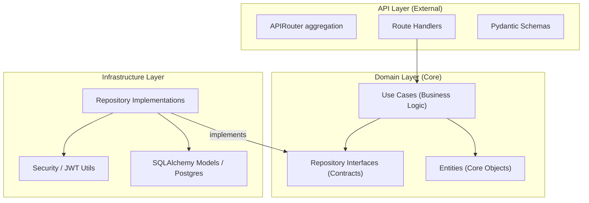
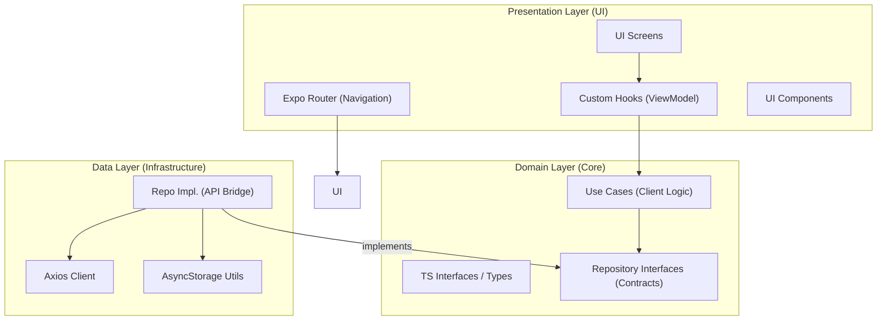

# IMS Architecture Diagrams & Codebase Mapping

This document provides a high-level overview of the Institute Management System (IMS) architecture, with a direct mapping to the file and folder structure in the codebase.

## 1. Backend Architecture (Clean Architecture)

### Backend Code Mapping

| Component | Code Location (Folder/File) | Role |
| :--- | :--- | :--- |
| **APIRouter** | [app/api/v1/router.py](file:///d:/MyProjects/IMS/backend/app/api/v1/router.py) | **Entry Point**: This file creates the main `APIRouter` and aggregates (includes) all the endpoint routers from the `endpoints/` folder. |
| **Route Handlers** | [app/api/v1/endpoints/](file:///d:/MyProjects/IMS/backend/app/api/v1/endpoints/) | **URL Definition**: The `@router.post("/login")` decorators you see here are part of individual routers that get merged into the main one. |
| **Pydantic Schemas** | [app/api/schemas.py](file:///d:/MyProjects/IMS/backend/app/api/schemas.py) | **Validation**: Defines what the JSON request and response should look like. |
| **Use Cases** | [app/domain/usecases/](file:///d:/MyProjects/IMS/backend/app/domain/usecases/) | **Business Logic**: Pure Python functions that orchestrate the logic independently of the DB or HTTP. |
| **Entities** | [app/domain/entities/](file:///d:/MyProjects/IMS/backend/app/domain/entities/) | **Core Objects**: Simple classes representing users, roles, etc. |
| **Interfaces** | [app/domain/repositories/](file:///d:/MyProjects/IMS/backend/app/domain/repositories/) | **Data Contracts**: Abstract classes that define *what* data operations are possible. |
| **Repo Impl.** | [app/infrastructure/repositories/](file:///d:/MyProjects/IMS/backend/app/infrastructure/repositories/) | **Database Access**: Concrete code that uses SQLAlchemy to talk to Postgres. |
| **DB Models** | [app/infrastructure/database/models.py](file:///d:/MyProjects/IMS/backend/app/infrastructure/database/models.py) | **Schema**: Defines the actual database tables. |
| **Security Utils** | [app/core/security.py](file:///d:/MyProjects/IMS/backend/app/core/security.py) & [password.py](file:///d:/MyProjects/IMS/backend/app/core/password.py) | **Safety**: Handles JWT token generation and password hashing. |

---

## 2. Mobile Architecture (Clean Architecture)

### Mobile Code Mapping

| Component | Code Location (Folder/File) | Role |
| :--- | :--- | :--- |
| **Expo Router** | [mobile/src/app/](file:///d:/MyProjects/IMS/mobile/src/app/) | **Navigation**: The folder structure here automatically defines the app's routes. |
| **UI Screens** | [mobile/src/presentation/screens/](file:///d:/MyProjects/IMS/mobile/src/presentation/screens/) | **Visual Layouts**: The actual screen components rendered for each route. |
| **Custom Hooks** | [mobile/src/presentation/hooks/](file:///d:/MyProjects/IMS/mobile/src/presentation/hooks/) | **ViewModel**: Manages local state and connects the UI to the Domain layer. |
| **UI Components** | [mobile/src/presentation/components/](file:///d:/MyProjects/IMS/mobile/src/presentation/components/) | **Branding**: Themed buttons, cards, and layouts used across screens. |
| **Use Cases** | [mobile/src/domain/usecases/](file:///d:/MyProjects/IMS/mobile/src/domain/usecases/) | **Client Logic**: Logic specific to the mobile application's workflow. |
| **TS Interfaces** | [mobile/src/domain/entities/](file:///d:/MyProjects/IMS/mobile/src/domain/entities/) | **Types**: TypeScript interfaces defining the shape of your data. |
| **Data Contracts**| [mobile/src/domain/repositories/](file:///d:/MyProjects/IMS/mobile/src/domain/repositories/) | **Promises**: Definitions of what data services the app needs. |
| **Repo Impl.** | [mobile/src/data/repositories/](file:///d:/MyProjects/IMS/mobile/src/data/repositories/) | **API Bridge**: Implementation that actually makes the network calls. |
| **Axios Client** | [mobile/src/core/api-client.ts](file:///d:/MyProjects/IMS/mobile/src/core/api-client.ts) | **Request Helper**: Configured Axios instance with interceptors for auth tokens. |
| **Storage Utils** | [mobile/src/data/local/storage.ts](file:///d:/MyProjects/IMS/mobile/src/data/local/storage.ts) | **Persistence**: Wraps `AsyncStorage` to save tokens and settings locally. |
